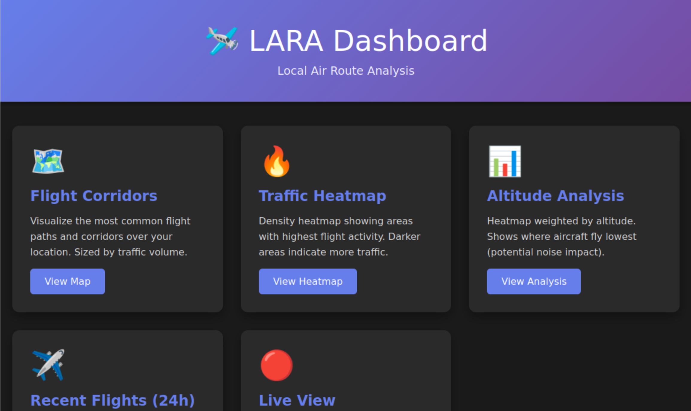
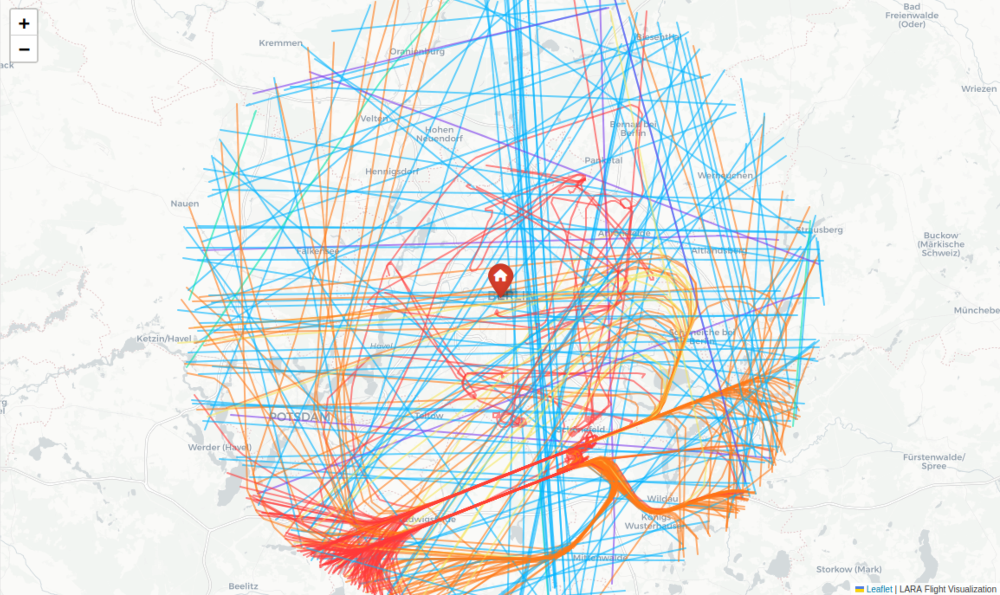
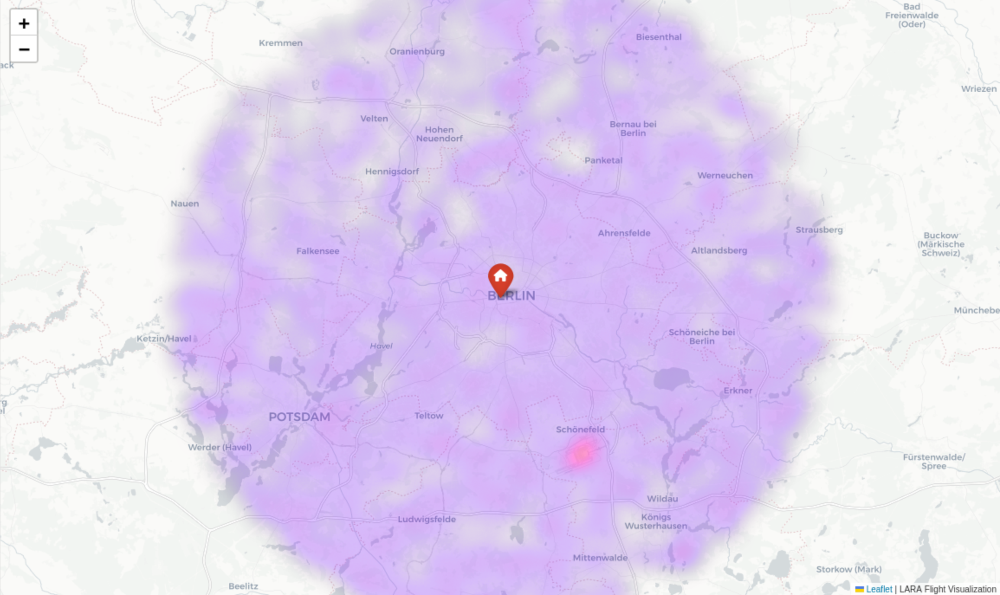
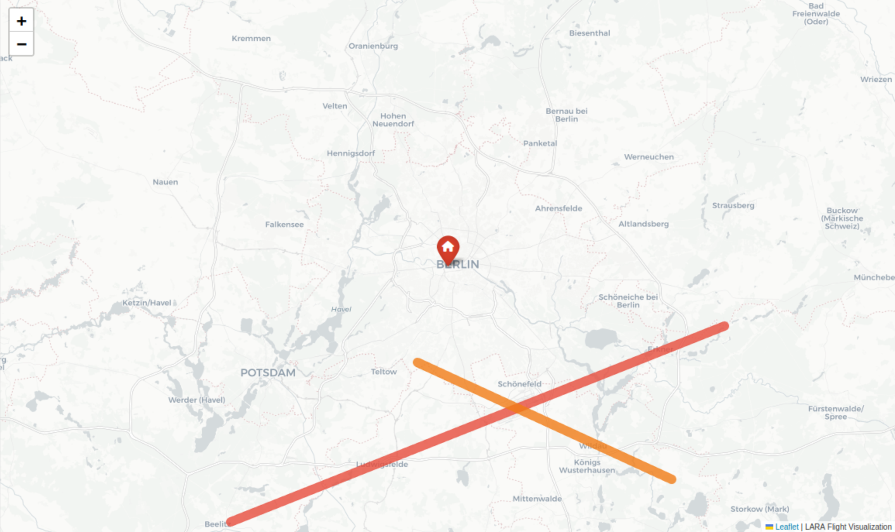

# LARA Example

This example demonstrates the capabilities of LARA and provides an overview of the expected output. The corresponding example files are stored in `docu/example/`.

## Configuration

The example configuration file located at `docu/example/config.yaml` must define a location with latitude and longitude coordinates, a location name, and tracking settings. These settings include the tracking radius around the location and the update interval (minimum: 10 seconds). In addition, the output database location must be specified. Providing API credentials for the OpenSky Network is strongly recommended; without credentials, data access will be rate-limited after some time.

```yaml
location:
  latitude: 50.516257
  longitude: 8.377525
  name: "Berlin Brandenburger Tor, Germany"

tracking:
  radius_km: 35
  update_interval_seconds: 15

database:
  path: "docu/example/lara_flights_berlin.db"

api:
  credentials_path: "credentials.json"
```

Additional configuration options are available in lara/config.py.

## Data Collection

To start data collection, run the scripts/collect.py script with the configuration file:

```python
sys.argv = [
  "scripts/collect.py",
  "--config", "docu/example/config.yaml"
]
main()
```

This command creates the database specified in the configuration file. For this example, the database file is lara_flights_berlin.db.

## Data Analysis

Data analysis is integrated into the visualization but can also be executed separately using the scripts/analyze.py script. Note that the analysis performed as part of the visualization does not produce an output file.

Run the analysis script with the following arguments:

```python
sys.argv = [
  "scripts/analyze.py",
  "--config", "docu/example/config.yaml",
  "--output", "docu/example/lara_analysis_berlin.json"
]
main()
```

This generates a complete analysis report. For this example, the output file is lara_analysis_berlin.json, which provides an overview of LARA’s analysis capabilities.

## Visualization

The visualization component generates an interactive dashboard containing all available analyses and maps. It can be created using the scripts/visualize.py script:

```python
sys.argv = [
  "scripts/visualize.py",
  "--dashboard",
  "--config", "docu/example/config.yaml",
  "--output-dir", "docu/example/html/"
]
main()
```

This command creates all required HTML files in the docu/example/html directory. To view the dashboard, open index.html in a web browser.



Take a look into the Recent Flights view, which will provide you a view of all tracked flights within the last 24h. (**Remark**: when you try this with the provided example, most likely, the database is too old, and you will have no flights visible in this view. Database was last updated 2026-02-01 12:04 CET)



With the traffic heatmap, you will get another view on the air occupancy over the location. In this example the most traffic is located at the BER airport.



With the corridor analysis, you will find the most used corridors.

